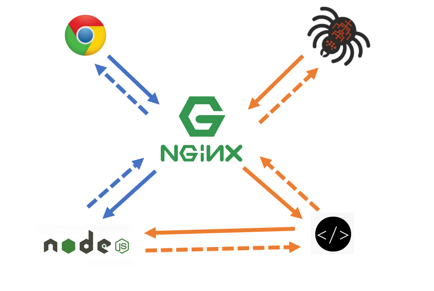

# 静态资源服务器

## 1. CSR

使用任何CSR技术开发应用程序，不限框架

## 2. 搭建中间层服务器

使用`express`或`koa2`搭建中间层服务器，托管静态资源

# prerender服务器

安装`prerender`

填写下面的代码

```js
const prerender = require("prerender");
const server = prerender({
  port: 5011 //更改prerender服务器端口
});
//使用prerender插件
server.use(prerender.removeScriptTags());
server.start();
```

# 使用nginx代理



配置参考：https://github.com/prerender/prerender#readme